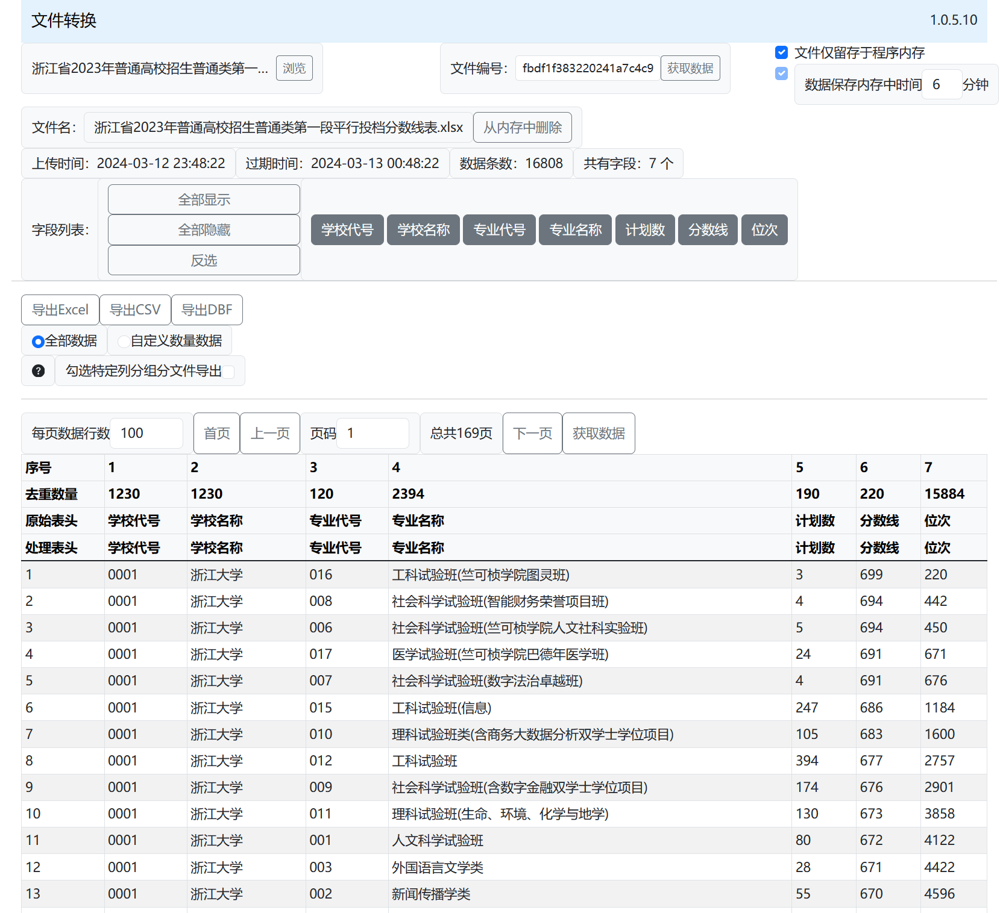

# 文件转换
一个简单的文件转换工具。支持 DBF、CSV、Excel之间的互转。同时可以将数据根据列分字段，生成多个文件，打包下载。同时所有上传的数据均保存至内存，做到安全可靠。

# 使用方法
## 页面展示


浏览文件，上传即可。目前仅支持文件的类型是：`.dbf`、`.csv`、`.xls`、`.xlsx`。其中 `.xls` 文件支持 EXCEL 5.0/95文件。

同时支持拖拽文件上传。
# 部署方式
环境要求：`Java 21`。
 从 release 中下载最新的 jar 包，然后执行命令：
```shell
java -jar file-convert-xxxx.jar
```
默认端口是 `14521`，最大上传文件大小是 `50M`。若需要修改，请在和 `.jar` 文件的同目录下放置 [application.yml](src/main/resources/application.yml) 文件，然后修改配置即可。
